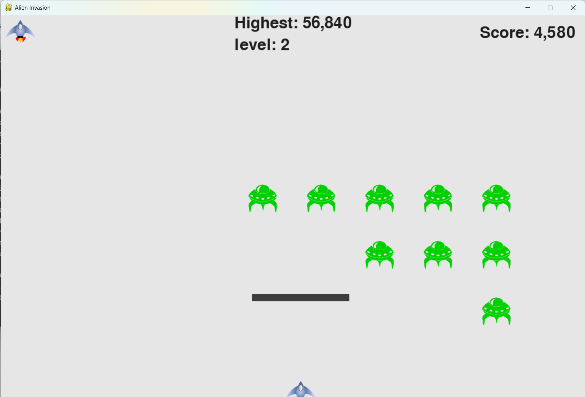

通过学习图灵程序设计丛书《python编程：从入门到实践》，完成一个简单的《外星人入侵》小游戏。

使用环境：

*   Linux 、Windows 均可
*   `Python 3.9.12`

环境配置：

*   `pip install pygame`

实现内容：

1.   飞机移动、子弹发射、外星人移动，及碰撞检测等基本操作；
2.   使用 `high_score.json` 记录最高得分；
3.   设计抖动特效，增强游戏体验。

可扩展部分：

1.   增加设置选择界面，目前设置只能在源码中修改子弹的大小，飞船及外新人的移速等；
2.   增加用户登录界面；
3.   利用 `.json` 文件，为每位用户记录其游戏历史等。

